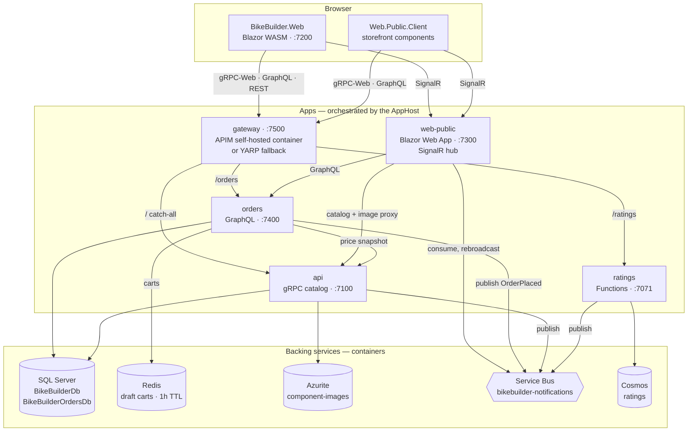
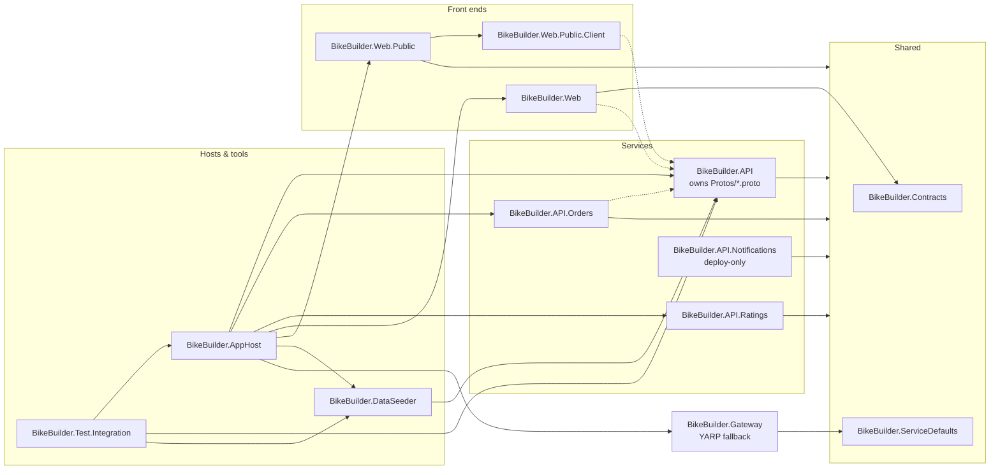

# BikeBuilder

> **Heads up: this is prototype-grade code.** This project is my first time using Claude-based
> development, and I'm using it to noodle on different approaches and see what sticks. Treat it
> as a proof of concept / playground rather than a reference implementation — corners are cut,
> patterns shift between features as I experiment, and nothing here is production-hardened.

BikeBuilder is a small microservices playground for building custom bikes: manage a catalog of
components (with images), assemble them into bike builds, rate the builds, sell them from a
guest-checkout storefront, and watch activity land in real time on a public site.

## What's in the solution

| Project | What it is |
| --- | --- |
| `BikeBuilder.AppHost` | .NET Aspire app host — the one thing you run: orchestrates SQL Server, Redis, Azurite, the Service Bus and Cosmos emulators, and all five apps |
| `BikeBuilder.ServiceDefaults` | Shared Aspire service defaults: OpenTelemetry (traces, metrics, logs), health checks, service discovery |
| `BikeBuilder.Web` | Blazor WebAssembly front end (MudBlazor), Auth0 login, talks gRPC-Web to the API and REST to the Ratings service; signed-in users get live order toasts, a back-office Orders view, and an In Process view of carts still being filled in |
| `BikeBuilder.API` | ASP.NET Core gRPC API (EF Core + SQL Server), component image upload to Azure Blob Storage, publishes events to Service Bus; catalog reads are anonymous so the storefront can browse |
| `BikeBuilder.API.Orders` | HotChocolate GraphQL orders microservice, a discrete bounded context: unsubmitted carts live in Redis under a TTL, placed orders in its own SQL Server database. Snapshots catalog prices via gRPC-Web and publishes OrderPlaced events to Service Bus |
| `BikeBuilder.API.Ratings` | Azure Functions (.NET isolated) ratings microservice backed by Cosmos DB, JWT-secured via Auth0 |
| `BikeBuilder.API.Notifications` | **Deploy-only — not part of the local AppHost topology.** Azure Functions fan-out that replaces the storefront's in-process SignalR hub when deployed, where scale-to-zero forbids an always-on consumer: a Service Bus trigger pushing to Azure SignalR Service in Serverless mode |
| `BikeBuilder.Web.Public` | Blazor Web App public site rendering InteractiveAuto — the first visit runs on a server circuit while the WebAssembly runtime downloads, later visits run in the browser: the guest-checkout storefront (StrawberryShake GraphQL client) as its landing page, with live activity toasts (Service Bus → SignalR) owned by the layout so they follow you across every page |
| `BikeBuilder.Web.Public.Client` | The storefront's WebAssembly half: the interactive components and their catalog gRPC-Web / orders GraphQL clients, which call those services through the API gateway once running client-side |
| `BikeBuilder.Gateway` | YARP stand-in for the API gateway: serves the gateway port with the same routes as the Azure API Management APIs whenever no APIM connection is configured (CI, or a dev machine without the `Apim:*` user secrets) |
| `BikeBuilder.Contracts` | Shared event/message contracts |
| `BikeBuilder.DataSeeder` | Console tool that fills the local dev stack with 1000+ real-sounding components, 100 bike builds, and 1–30 ratings each |
| `BikeBuilder.Test.Integration` | End-to-end smoke tests: the Aspire testing host boots the whole system (with a stub OIDC issuer standing in for Auth0) and Playwright drives the real UI, recording video |

## Architecture

### At run time



`Web.Public.Client` sits in the Browser box because that is where it ends up: the storefront
renders InteractiveAuto, so its components run on a server circuit inside `web-public` on the
first visit and in the browser once the WebAssembly runtime is cached. Note that `orders`
snapshots prices from `api` rather than reaching into the catalog database — they are separate
bounded contexts. The `dataseeder` app is left out; it touches SQL and Cosmos directly and only
runs when you start it by hand.

All browser traffic to the three APIs goes through the **gateway** origin (`:7500` in dev,
`:18700` in tests): the real Azure API Management self-hosted gateway container when the
`Apim:*` user secrets are configured (see [`infra/README.md`](infra/README.md)), otherwise the
`BikeBuilder.Gateway` YARP stand-in with the same routes. The catalog api owns the root
catch-all because gRPC-Web method paths cannot carry a prefix. Server-to-server calls
(`orders` → `api`, `web-public` → `api`/`orders`) and the SignalR hub stay direct.

### Project references



A solid arrow means "references"; an arrow into the Shared box means the project references
both shared projects. Dashed arrows are **not** project references — those three compile
`BikeBuilder.API`'s `.proto` files as gRPC *clients* through linked `<Protobuf>` items.

Two absences are deliberate. `BikeBuilder.Web` references `Contracts` but not `ServiceDefaults`
— a WebAssembly app has no server host to configure. And the AppHost does not reference
`BikeBuilder.API.Notifications` at all, which is why it never starts locally.

## Running it

Prerequisites: Docker Desktop, the .NET 10 SDK, and
[Azure Functions Core Tools](https://learn.microsoft.com/azure/azure-functions/functions-run-local)
≥ 4.0.6280 (Aspire launches the Functions app through `func start`).

```powershell
dotnet run --project Src/BikeBuilder.AppHost
```

(or F5 on the AppHost project in Visual Studio, or `aspire run`). The Aspire dashboard opens
automatically: every backing service and app with its endpoints, logs, and telemetry in one
place. The web app is at https://localhost:7200, the public site at https://localhost:7300.

The emulator containers are persistent and keep their data across AppHost runs (SQL, blobs,
and Cosmos documents survive a restart). Redis is the deliberate exception — it holds nothing
but in-flight carts, which expire within the hour anyway, so it gets no data volume and starts
empty every time. Auth is a real Auth0 tenant in local dev; integration tests swap in a stub
OIDC issuer so they run fully offline.

Browser calls to the three APIs go through the **gateway** at http://localhost:7500. Out of
the box that is the `BikeBuilder.Gateway` YARP stand-in; once Azure API Management is deployed
and `infra/new-gateway-token.ps1` has written the `Apim:*` user secrets, the AppHost runs the
real APIM **self-hosted gateway container** there instead — same origin, same routes, but the
routing now comes from the cloud instance's API definitions. To go back to the stand-in:
`dotnet user-secrets remove Apim:ConfigEndpoint --project Src/BikeBuilder.AppHost`.

To fill the dev stack with realistic sample data (1000+ components, 100 bike builds, ratings),
start the `dataseeder` resource from the Aspire dashboard (it's marked explicit-start, so it
only runs when you tell it to). Running it a second time refuses to touch a non-empty database;
to wipe and reseed, run it by hand with the connection strings from the dashboard's environment
view and pass `--reset`.

## Storefront

The storefront is the public site's landing page at https://localhost:7300 (`/store` still
routes there): browse components and bike builds (prices come from the catalog; images are
proxied same-origin), add them to a cart, and check out as a guest — just a name, no account.

A cart is a draft order held in **Redis**, not a database row, under a one-hour TTL that slides
on every add or remove — so an active shopper never loses their cart, and abandoned ones clean
themselves up. Only a processed order reaches the Orders service's SQL database. The two stores
number orders independently (drafts by Guid, placed orders by SQL identity), so an order is
renumbered at checkout; the storefront drops the draft id at that point, so this is invisible
to the shopper.

Processing publishes an `OrderPlaced` event. The toast lands on every page of the public site —
the layout owns the SignalR connection, not any one page — and, via the same hub, for every
signed-in user of the web app. The web app's **In Process** page lists the carts currently held
in Redis with a countdown to expiry, refreshing itself as they come and go.

The orders GraphQL endpoint (with the Nitro IDE in dev) is at https://localhost:7400/graphql.

## Deploying to Azure

The `infra/` folder provisions the whole system into a single subscription, staying inside
Azure's always-free grants wherever they exist — with one deliberate exception: API Management
on the Developer tier (~$50/month), the cheapest tier that can feed the local self-hosted
gateway container. See [`infra/README.md`](infra/README.md) for the cost breakdown and the
step-by-step. Deployed browsers reach the three APIs through the APIM gateway URL, matching
the gateway origin they use locally.

The deployed topology differs from local dev in one structural way. Container Apps only stay
free with scale-to-zero, which forbids an always-on process, so the storefront's in-process
SignalR hub and Service Bus consumer are replaced by `BikeBuilder.API.Notifications` — a
Service Bus-triggered Function pushing through Azure SignalR Service in Serverless mode, where
the service holds the client connections and nothing has to stay awake.

> **Known gap:** `infra/resources.bicep` provisions no Redis, because Azure Cache for Redis has
> no free tier. Draft carts therefore have nowhere to live, and the Orders service is
> incomplete in a deployed environment until one is added.

## Telemetry

Every server app (API, Orders, Web.Public, Ratings) exports OpenTelemetry traces, metrics, and logs
over OTLP to the Aspire dashboard — open the Traces view to follow a single request across
API → SQL/Blob → Service Bus → Web.Public → SignalR broadcast (the Service Bus consumer may
appear as a linked trace reference rather than a nested span — that's the messaging
convention, click through it). Telemetry is in-memory and resets with the AppHost.

## Tests

```powershell
dotnet test Src/BikeBuilder.Test.Integration
```

Two end-to-end tests cover the whole journey: one logs in, creates a component with an image,
builds a bike, rates it, and verifies the component, build and rating toasts land live on the
public site; the other buys from the storefront as a guest, checks the open cart shows on the
web app's In Process page and is gone once processed, and verifies the order toast on both the
public site and the signed-in web app. Requires Docker and the
Azure Functions Core Tools. The Aspire testing host (`Aspire.Hosting.Testing`) runs the same
AppHost in test mode: fixed 18xxx ports, a stub OIDC issuer instead of Auth0, and
session-scoped containers that are torn down with the fixture. Debugging the test from Visual
Studio's Test Explorer runs the browser headed; videos land in `TestResults/videos`.

The browsers reach the APIs through the gateway origin (`:18700`), so the suite exercises
whichever gateway the AppHost selected: with the `Apim:GatewayTokenTest` user secret present,
the real APIM self-hosted gateway container (routing configured in Azure); without it — CI,
or any machine with no APIM connection — the YARP stand-in with identical routes. The tests
themselves are the same either way.
