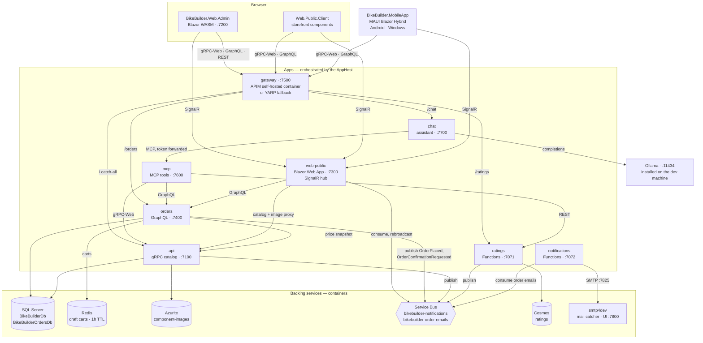
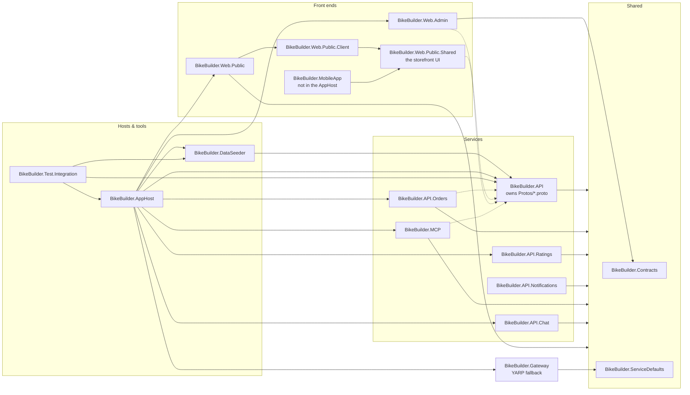

# BikeBuilder

> **Heads up: this is prototype-grade code.** This project is my first time using Claude-based
> development, and I'm using it to noodle on different approaches and see what sticks. Treat it
> as a proof of concept / playground rather than a reference implementation — corners are cut,
> patterns shift between features as I experiment, and nothing here is production-hardened.

BikeBuilder is a small microservices playground for building custom bikes: manage a catalog of
components (with images), assemble them into bike builds, rate the builds, sell them from a
guest-checkout storefront, and watch activity land in real time on a public site.

## What's in the solution

| Project | What it is |
| --- | --- |
| `BikeBuilder.AppHost` | .NET Aspire app host — the one thing you run: orchestrates SQL Server, Redis, Azurite, the Service Bus and Cosmos emulators, and all the apps |
| `BikeBuilder.ServiceDefaults` | Shared Aspire service defaults: OpenTelemetry (traces, metrics, logs), health checks, service discovery |
| `BikeBuilder.Web.Admin` | Blazor WebAssembly front end (MudBlazor), Auth0 login, talks gRPC-Web to the API and REST to the Ratings service; signed-in users get live order toasts, a back-office Orders view, an In Process view of carts still being filled in, and (Assistant/Admin roles) a chat window on every page that answers free-text questions about the data |
| `BikeBuilder.API` | ASP.NET Core gRPC API (EF Core + SQL Server), component image upload to Azure Blob Storage, publishes events to Service Bus; catalog reads are anonymous so the storefront can browse |
| `BikeBuilder.API.Orders` | HotChocolate GraphQL orders microservice, a discrete bounded context: unsubmitted carts live in Redis under a TTL, placed orders in its own SQL Server database. Snapshots catalog prices via gRPC-Web and publishes OrderPlaced events to Service Bus |
| `BikeBuilder.API.Ratings` | Azure Functions (.NET isolated) ratings microservice backed by Cosmos DB, JWT-secured via Auth0 |
| `BikeBuilder.MCP` | Model Context Protocol server (Streamable HTTP at `/mcp`) exposing read-only tools over components, bike builds, orders and ratings. Owns no data — it calls the same three services the web apps do and forwards the caller's token to the role-gated order queries. Usable from Claude Code, VS Code, or the chat host below |
| `BikeBuilder.API.Chat` | The admin app's assistant backend: runs a tool-calling loop (Microsoft.Extensions.AI + OllamaSharp) against a model served by the Ollama installed on the dev machine, with the MCP server's tools. Admin-only, reached through the gateway's `/chat` prefix |
| `BikeBuilder.API.Notifications` | Azure Functions (.NET isolated) consumers of the Service Bus queues. Everywhere: the order-confirmation email — a Service Bus trigger on its own queue, delivered by SMTP into the local smtp4dev catcher or, deployed, through Mailjet. Deployed only: the fan-out that replaces the storefront's in-process SignalR hub, where scale-to-zero forbids an always-on consumer, pushing to Azure SignalR Service in Serverless mode |
| `BikeBuilder.Web.Public` | Blazor Web App public site rendering InteractiveAuto — the first visit runs on a server circuit while the WebAssembly runtime downloads, later visits run in the browser: the guest-checkout storefront (StrawberryShake GraphQL client) as its landing page, with live activity toasts (Service Bus → SignalR) owned by the layout so they follow you across every page |
| `BikeBuilder.Web.Public.Client` | The storefront's WebAssembly half: a thin composition root that wires the shared storefront components to browser services (localStorage, origin-relative URLs) once pages run client-side |
| `BikeBuilder.Web.Public.Shared` | Razor class library holding the entire storefront — pages, layout, catalog gRPC-Web and orders GraphQL clients — shared verbatim between the web storefront and the mobile app |
| `BikeBuilder.MobileApp` | .NET MAUI Blazor Hybrid app (Android, plus a Windows head for the dev loop) rendering the same shared storefront in a native shell: platform preferences instead of localStorage, configured URLs instead of page origins |
| `BikeBuilder.Gateway` | YARP stand-in for the API gateway: serves the gateway port with the same routes as the Azure API Management APIs whenever no APIM connection is configured (CI, or a dev machine without the `Apim:*` user secrets) |
| `BikeBuilder.Contracts` | Shared event/message contracts |
| `BikeBuilder.DataSeeder` | Console tool that fills the local dev stack with 1000+ real-sounding components, 100 bike builds, and 1–30 ratings each |
| `BikeBuilder.Test.Integration` | End-to-end smoke tests: the Aspire testing host boots the whole system (with a stub OIDC issuer standing in for Auth0) and Playwright drives the real UI, recording video |

## Architecture

### At run time



`Web.Public.Client` sits in the Browser box because that is where it ends up: the storefront
renders InteractiveAuto, so its components run on a server circuit inside `web-public` on the
first visit and in the browser once the WebAssembly runtime is cached. `BikeBuilder.MobileApp`
renders those same components (from `BikeBuilder.Web.Public.Shared`) inside a native WebView,
talking to the same gateway and hub — from the Android emulator the host is `10.0.2.2` instead
of `localhost`. Note that `orders`
snapshots prices from `api` rather than reaching into the catalog database — they are separate
bounded contexts. The `dataseeder` app is left out; it touches SQL and Cosmos directly and only
runs when you start it by hand.

All browser traffic to the APIs goes through the **gateway** origin (`:7500` in dev,
`:18700` in tests): the real Azure API Management self-hosted gateway container when the
`Apim:*` user secrets are configured (see [`infra/README.md`](infra/README.md)), otherwise the
`BikeBuilder.Gateway` YARP stand-in with the same routes. The catalog api owns the root
catch-all because gRPC-Web method paths cannot carry a prefix. Server-to-server calls
(`orders` → `api`, `web-public` → `api`/`orders`, `chat` → `mcp` → everything) and the
SignalR hub stay direct; the MCP server is not on the gateway at all.

### Project references



A solid arrow means "references"; an arrow into the Shared box means the project references
both shared projects. Dashed arrows are **not** project references — those four compile
`BikeBuilder.API`'s `.proto` files as gRPC *clients* through linked `<Protobuf>` items.

Two absences are deliberate. `BikeBuilder.Web.Admin` references `Contracts` but not `ServiceDefaults`
— a WebAssembly app has no server host to configure. And the AppHost does not reference
`BikeBuilder.MobileApp` — Aspire orchestrates processes, and an Android app isn't one; the
mobile app is launched separately and simply points at the AppHost's endpoints.

## Running it

Prerequisites: Docker Desktop, the .NET 10 SDK, and
[Azure Functions Core Tools](https://learn.microsoft.com/azure/azure-functions/functions-run-local)
≥ 4.0.6280 (Aspire launches the two Functions apps through `func start`). When Visual Studio owns
the session (F5, or any Test Explorer run) it would normally launch the Functions projects itself
with its own bundled Core Tools, and that copy can lag far enough behind to be unable to host the
notifications worker - so the AppHost forces those two resources to run as plain processes and
prefers the machine-wide install under `Program Files` whenever it finds one. The trade-off is
that the two Functions projects can't be debugged from VS; everything else still can.

```powershell
dotnet run --project Src/BikeBuilder.AppHost
```

(or F5 on the AppHost project in Visual Studio, or `aspire run`). The Aspire dashboard opens
automatically: every backing service and app with its endpoints, logs, and telemetry in one
place. The web app is at https://localhost:7200, the public site at https://localhost:7300.
Every email the system sends lands in the **smtp4dev** catcher at http://localhost:7800 — nothing
leaves the machine.

The emulator containers are persistent and keep their data across AppHost runs (SQL, blobs,
and Cosmos documents survive a restart). Redis is the deliberate exception — it holds nothing
but in-flight carts, which expire within the hour anyway, so it gets no data volume and starts
empty every time. One consequence of persistence: the Service Bus emulator reads its queue list
once, at container start, so after pulling a change that adds a queue, remove the `servicebus`
container pair (dashboard, or `docker rm -f`) and let the AppHost recreate it. Auth is a real
Auth0 tenant in local dev; integration tests swap in a stub OIDC issuer so they run fully offline.

Browser calls to the three APIs go through the **gateway** at http://localhost:7500. Out of
the box that is the `BikeBuilder.Gateway` YARP stand-in; once Azure API Management is deployed
and `infra/new-gateway-token.ps1` has written the `Apim:*` user secrets, the AppHost runs the
real APIM **self-hosted gateway container** there instead — same origin, same routes, but the
routing now comes from the cloud instance's API definitions. To go back to the stand-in:
`dotnet user-secrets remove Apim:ConfigEndpoint --project Src/BikeBuilder.AppHost`.

### The mobile app

`BikeBuilder.MobileApp` is not orchestrated by the AppHost — start the AppHost first, then run
the app against it. The fast loop is the Windows head, which talks straight to `localhost`:

```powershell
dotnet build Src/BikeBuilder.MobileApp -t:Run -f net10.0-windows10.0.19041.0
```

For Android, deploy to an emulator from Visual Studio (or `dotnet build -t:Run -f net10.0-android`
with an emulator running); the app reaches the host machine via `10.0.2.2`, which its dev
configuration (`Services/AppEnvironment.cs`) already points at. A physical device needs the
host's LAN IP there instead. Publishing for the Play Store
(`dotnet publish -f net10.0-android -c Release` produces an `.aab`, plus signing config and
HTTPS endpoints) is future work.

To fill the dev stack with realistic sample data (1000+ components, 100 bike builds, ratings),
start the `dataseeder` resource from the Aspire dashboard (it's marked explicit-start, so it
only runs when you tell it to). Running it a second time refuses to touch a non-empty database;
to wipe and reseed, run it by hand with the connection strings from the dashboard's environment
view and pass `--reset`. If only the ratings are missing (the Cosmos emulator started empty
while the catalog survived), pass `--ratings-only` instead: it leaves the catalog alone and
rates the bike builds it already has.

## Roles & authorization

Access to the signed-in web app is role-based. Roles arrive as a claim in the Auth0 tokens
(a namespaced custom claim, `https://bikebuilder/roles`; the integration tests' stub issuer
uses a plain `role` claim — the claim type is the `Auth0:RoleClaim` config key everywhere).
The same policies are registered client-side (pages, nav links, home cards) and server-side
(gRPC writes, GraphQL order queries, the ratings Function), so hiding a button is never the
only line of defense.

| Role | Grants |
| --- | --- |
| `ComponentEditor` | Create/edit/delete components and their images; the Components page |
| `BikeBuilder` | Create/edit/delete bike builds and their component assignments; rate builds; the Bike Builds pages |
| `OrderViewer` | The Orders and In Process pages (the role-gated GraphQL order queries) |
| `Assistant` | The assistant chat window (its order tools still need `OrderViewer`) |
| `Admin` | Everything above, plus the Admin page for managing users and roles |

Catalog *reads* stay anonymous — the public storefront depends on them. A signed-in user
with no roles can open the app but sees only the Home page; navigating anywhere else shows
a "Not authorized" message.

### The Admin page

`/admin` (Admin role) manages users through whichever backend `BikeBuilder.API` has
configured:

- **Real Auth0** — the Management API, via an M2M application (see the runbook below).
  Lists users with their roles, creates users, and edits existing users' roles. Configure
  with user secrets on the API project:

  ```powershell
  dotnet user-secrets set Auth0:Management:Domain dev-xyz.us.auth0.com --project Src/BikeBuilder.API
  dotnet user-secrets set Auth0:Management:ClientId <m2m-client-id> --project Src/BikeBuilder.API
  dotnet user-secrets set Auth0:Management:ClientSecret <m2m-secret> --project Src/BikeBuilder.API
  ```

- **Integration tests** — the stub OIDC container's runtime API (`POST /api/v1/user`). The
  Admin page can list known users and *create* users with roles (which is how the role
  smoke test provisions an OrderViewer mid-run), but the pinned image cannot change an
  existing user, so role edits are hidden in this mode.

- **Neither configured** — the page shows a "user administration is not configured" notice.

### Auth0 tenant runbook (one-time)

1. **Roles**: User Management → Roles → create `ComponentEditor`, `BikeBuilder`,
   `OrderViewer`, `Assistant`, `Admin`; assign them to your users.
2. **Action**: Actions → Library → build a custom post-login Action and attach it to the
   Login flow, so the roles land in both tokens:

   ```js
   exports.onExecutePostLogin = async (event, api) => {
     const roles = event.authorization?.roles ?? [];
     api.idToken.setCustomClaim('https://bikebuilder/roles', roles);
     api.accessToken.setCustomClaim('https://bikebuilder/roles', roles);
   };
   ```

3. **M2M app for the Admin page** (optional): Applications → create a Machine to Machine
   application authorized for the **Auth0 Management API** with scopes `read:users`,
   `create:users`, `read:roles`, `read:role_members`, `create:role_members`,
   `delete:role_members`; wire its credentials into the API's user secrets as above.
4. **Verify**: sign in, paste the access token into jwt.io, and check the
   `https://bikebuilder/roles` claim carries your roles.

## Storefront

The storefront is the public site's landing page at https://localhost:7300 (`/store` still
routes there): browse components and bike builds (prices come from the catalog; images are
proxied same-origin), add them to a cart, and check out as a guest — a name to start, no account.

**Checkout** (`/checkout`) collects contact details, a shipping address (billing defaults to
the same), a shipping method — Standard $9.99, Express $24.99 or Overnight $49.99, priced by
the orders service so the client can't undercut it — and a card. Payment is fake: the service
runs the checks a gateway would (Luhn, expiry, CVC) and decides deterministically. Any number
that passes Luhn is approved (`4242 4242 4242 4242` is the classic; there's a "Use a test card"
link), and `4000 0000 0000 0002` is always declined. Only the brand, last four digits and expiry
are stored — the full number and CVC never leave the request. Validation and authorization
happen *before* the cart is claimed, so a declined card leaves the cart exactly as it was.

A cart is a draft order held in **Redis**, not a database row, under a one-hour TTL that slides
on every add or remove — so an active shopper never loses their cart, and abandoned ones clean
themselves up. Only a processed order reaches the Orders service's SQL database. The two stores
number orders independently (drafts by Guid, placed orders by SQL identity), so an order is
renumbered at checkout; the storefront drops the draft id at that point, so this is invisible
to the shopper.

Placing the order publishes an `OrderPlaced` event to Service Bus carrying the order id,
customer, item count, subtotal, shipping method and cost, grand total, the ship-to city/state/
country and the card summary (`Visa •••• 4242`). The toast lands on every page of the public site —
the layout owns the SignalR connection, not any one page — and, via the same hub, for every
signed-in user of the web app. The web app's **In Process** page lists the carts currently held
in Redis with a countdown to expiry, refreshing itself as they come and go.

If the shopper left an email address, a **receipt** goes out too: the orders service publishes an
`OrderConfirmationRequested` event — line items, totals, the ship-to address and the card summary,
everything the email needs so nobody reads the orders database to write it — on its own queue
(`bikebuilder-order-emails`; a second receiver on the notifications queue would compete with the
toast fan-out, and Basic-tier Service Bus has no topics). `BikeBuilder.API.Notifications`
consumes it and sends. Locally that is SMTP into the smtp4dev catcher at http://localhost:7800;
deployed, Mailjet's Send API. A send that fails is redelivered up to ten times and then
dead-lettered, and a failure to *queue* the receipt is logged rather than surfaced — the order is
already placed by then.

The orders GraphQL endpoint (with the Nitro IDE in dev) is at https://localhost:7400/graphql.

## The assistant (local AI)

The robot button in the bottom-left corner of every admin page (`Assistant` or `Admin` role)
opens a chat window that answers free-text questions — "which bike build has the best average
rating?", "what sells best?", "which forks have more than 140 mm of travel?" — by letting a
language model call tools against the live data. The window belongs to the layout, so the
conversation follows you from page to page, and every reply shows the tools it called and
what came back, so answers stay checkable.

Two pieces make it work, both orchestrated by the AppHost:

- **`BikeBuilder.MCP`** is a [Model Context Protocol](https://modelcontextprotocol.io) server
  at http://localhost:7601/mcp with read-only tools: `search_components`, `get_component`,
  `search_bike_builds`, `get_bike_build`, `list_orders`, `get_order`, `list_draft_orders`,
  `orders_summary`, `list_ratings`, `search_rating_comments` (review text across builds),
  `get_rating_summaries`, `top_rated_bike_builds`, and a `describe_data` orientation. It owns no database — it calls `api` (gRPC-Web), `orders`
  (GraphQL) and `ratings` (REST) like the web apps do, and forwards the caller's bearer token so
  the role-gated order queries apply to the actual user.
- **`BikeBuilder.API.Chat`** runs the tool-calling loop with Microsoft.Extensions.AI and
  OllamaSharp, connecting to the MCP server as the signed-in user, and serves the page's
  `/api/chat` endpoints through the gateway's `/chat` prefix.

The model runs in **Ollama on your machine** — nothing is sent to a cloud service. Install
[Ollama](https://ollama.com), then pull the default model:

```powershell
ollama pull qwen3.5
```

`qwen3.5` (~10B parameters, native tool calling) is the default; the endpoint and model are the
`ollama` connection string in `Src/BikeBuilder.AppHost/appsettings.json`, overridable per
machine with user secrets:

```powershell
dotnet user-secrets set ConnectionStrings:ollama "Endpoint=http://localhost:11434;Model=qwen3.5:35b-a3b" --project Src/BikeBuilder.AppHost
```

Any Ollama model with the `tools` capability works (`ollama show <model>` lists them);
`qwen3.5:35b-a3b` (a mixture-of-experts model with 3B active parameters) or `gpt-oss:20b` are
good upgrades on a machine with 32 GB+ of GPU-addressable memory. The chat host's `Ollama:Think`
setting turns a reasoning model's "thinking" on (off by default — it multiplies latency on
lookup questions). Nothing in the topology needs Ollama to start: the page shows what is
missing, and CI runs the full stack with no model at all.

To use the MCP server from an IDE instead of the chat page, point any MCP client at it while
the AppHost is running — anonymous access is on in Development (`Mcp:AllowAnonymous`), so the
order tools answer "sign in required" from there:

```powershell
claude mcp add --transport http bikebuilder http://localhost:7601/mcp
```

or in VS Code's `mcp.json`: `{ "servers": { "bikebuilder": { "type": "http", "url": "http://localhost:7601/mcp" } } }`.

## Deploying to Azure

The `infra/` folder provisions the whole system into a single subscription, staying inside
Azure's always-free grants wherever they exist — with one deliberate exception: API Management
on the Developer tier (~$50/month), the cheapest tier that can feed the local self-hosted
gateway container. See [`infra/README.md`](infra/README.md) for the cost breakdown and the
step-by-step. Deployed browsers reach the three APIs through the APIM gateway URL, matching
the gateway origin they use locally.

The deployed topology differs from local dev in one structural way. Container Apps only stay
free with scale-to-zero, which forbids an always-on process, so the storefront's in-process
SignalR hub and Service Bus consumer are replaced by `BikeBuilder.API.Notifications` — a
Service Bus-triggered Function pushing through Azure SignalR Service in Serverless mode, where
the service holds the client connections and nothing has to stay awake. The same Function App
sends the order receipts, through Mailjet instead of the local mail catcher — the API key pair is
the one secret in the stack, passed via `deploy.ps1 -MailjetApiKey/-MailjetSecretKey`.

> **Known gap:** `infra/resources.bicep` provisions no Redis, because Azure Cache for Redis has
> no free tier. Draft carts therefore have nowhere to live, and the Orders service is
> incomplete in a deployed environment until one is added.

## Telemetry

Every server app (API, Orders, Web.Public, Ratings, Notifications, MCP, Chat, Gateway) exports OpenTelemetry traces, metrics, and logs
over OTLP to the Aspire dashboard — open the Traces view to follow a single request across
API → SQL/Blob → Service Bus → Web.Public → SignalR broadcast, or a checkout across
Orders → Service Bus → Notifications → SMTP. An assistant question reads as one trace too: chat → the
model calls (GenAI spans) → each MCP tool call → the service it queried. Telemetry is
in-memory and resets with the AppHost; deployed, the same telemetry goes to the App Insights
instance `infra/` provisions (the Azure Monitor exporter switches on when its connection
string is present).

**The W3C trace id is the system's correlation id.** It starts in the client — the WASM apps and
the MAUI app mint a `traceparent` per request (`TraceContextHandler` in `BikeBuilder.Contracts`),
and the storefront's server circuit parents its calls under Blazor's own event spans — and it comes
back on every response: the `X-Trace-Id` header from every service and the gateway, a `trace-id`
trailer on gRPC calls, and a `traceId` extension on GraphQL errors. Error toasts end in
`(ref <id>)`, so the string a user reads off a failed checkout is exactly what the dashboard's trace
search takes. Service Bus messages carry the same id as `CorrelationId` (plus a `MessageId`), and
the consumers parent their work — the hub broadcast, the receipt email — on the producer's trace,
so a checkout reads as one story from the click to the SMTP send rather than two linked traces.
The toasts themselves carry it too: hover one and its title shows the originating trace. Console
log lines print `TraceId`/`SpanId` scopes, which is what the integration tests dump on failure.

## Tests

```powershell
dotnet test Src/BikeBuilder.Test.Integration
```

Four end-to-end tests cover the whole journey: one logs in, creates a component with an image,
builds a bike, rates it, and verifies the component, build and rating toasts land live on the
public site; another buys from the storefront as a guest, checks the open cart shows on the
web app's In Process page and is gone once processed, verifies the order toast on both the
public site and the signed-in web app, and reads the confirmation email back out of the smtp4dev
catcher's API (its declined-card twin checks the error toast ends in a `(ref <trace id>)`); the third exercises the role system — as the Admin it
creates an OrderViewer user through the Admin page, signs in as that user in a fresh browser
context, and checks the nav is trimmed to the order sections and a direct hit on /components
lands on the "Not authorized" page; the fourth opens the assistant window, checks it reaches its
backend and stays open when navigating to another page, and — only where Ollama is running, so
never on CI — asks a question and waits for the model's answer. (The stub user
`testuser` carries the Admin role, which is why the other tests can touch every surface.) A
small fifth test posts through the gateway with a `traceparent` and checks the same trace id
comes back in `X-Trace-Id`. On failure the browser console dump records each failed response's
trace id, and the per-resource console logs print trace ids on every line, so a failure can be
followed from the Playwright step into the app that produced it.
Requires Docker and the
Azure Functions Core Tools. The Aspire testing host (`Aspire.Hosting.Testing`) runs the same
AppHost in test mode: fixed 18xxx ports, a stub OIDC issuer instead of Auth0, and
session-scoped containers that are torn down with the fixture. Debugging the test from Visual
Studio's Test Explorer runs the browser headed; videos land in `TestResults/videos`.

The browsers reach the APIs through the gateway origin (`:18700`), so the suite exercises
whichever gateway the AppHost selected: with the `Apim:GatewayTokenTest` user secret present,
the real APIM self-hosted gateway container (routing configured in Azure); without it — CI,
or any machine with no APIM connection — the YARP stand-in with identical routes. The tests
themselves are the same either way.
