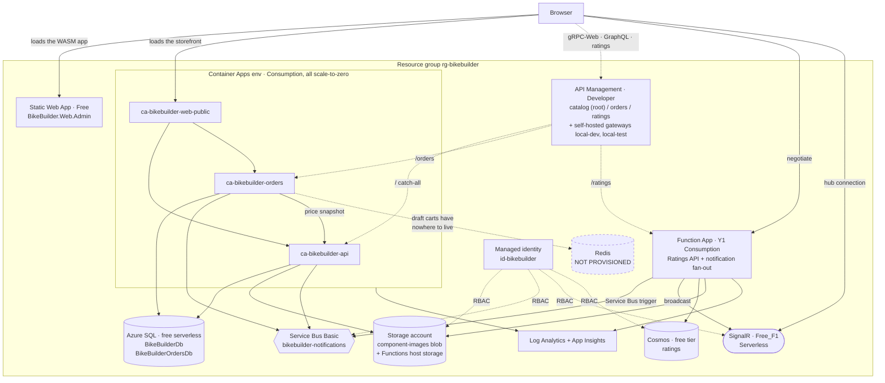

# Deploying BikeBuilder to Azure on free tiers

Provisions the whole system into one subscription, staying inside Azure's always-free
grants wherever they exist — with one deliberate exception: **API Management on the
Developer tier (~$50/month)**, the cheapest tier that can feed the self-hosted gateway
container local development and the integration tests run.

## What gets provisioned



Browsers reach the three APIs through **API Management**: the catalog api owns the empty
root path (gRPC-Web method paths like `/bikebuilder.ComponentService/…` cannot carry a
prefix), while orders and ratings sit under `/orders` and `/ratings` — APIM matches the
most specific API path first. The instance also registers two **self-hosted gateways**
(`local-dev`, `local-test`); the Aspire AppHost runs the gateway container against them so
local traffic flows through the same API definitions, with a per-API policy rewriting the
backend to `host.docker.internal` based on which gateway is asking. Server-to-server calls
(orders→api, storefront→api/orders) and the SignalR path stay direct.

Two things to read off this. The notification fan-out is a **Function**, not part of the
storefront — see [why scale-to-zero is load-bearing](#why-scale-to-zero-is-load-bearing) below;
browsers negotiate against the Function App and then hold their connection with SignalR Service
directly, so nothing has to stay awake. And **Redis is not provisioned**: Azure Cache for Redis
has no free tier, so the storefront's draft carts have nowhere to live and `ca-bikebuilder-orders`
is incomplete until one is added.

## What Bicep cannot do

**Creating a tenant or a subscription is not an ARM operation.** A tenant is a Microsoft
Entra ID directory (a directory-plane object) and a subscription belongs to a billing
account, so neither has a resource provider to deploy against.
`Microsoft.Subscription/aliases` exists but only works under an Enterprise Agreement, MCA,
or Partner agreement — it cannot create the pay-as-you-go subscription that comes with a
personal free account.

So this part is manual, once:

1. Sign up at <https://azure.microsoft.com/free> — this creates both an Entra tenant and a
   subscription, and includes a credit for the first 30 days plus the always-free services
   used below. A card is required for identity verification.
2. `az login`
3. `az account show --query id -o tsv` → this is the `-SubscriptionId` for `deploy.ps1`.

To create an *additional* tenant later (optional, useful to keep this isolated from a work
directory): Azure portal → Microsoft Entra ID → Manage tenants → Create. A new tenant has no
subscription of its own; you either transfer one in or sign up again from it.

## What it costs

| Service | Free allowance | Notes |
| --- | --- | --- |
| Static Web Apps | Always free | Blazor WebAssembly front end, incl. TLS + custom domain |
| Azure Functions (Consumption) | 1M executions + 400k GB-s/month | Ratings API + the notification fan-out |
| Container Apps | 180k vCPU-s, 360k GiB-s, 2M requests/month | Only stays free **with scale-to-zero** — see below |
| Azure SQL | 100k vCore-s + 32 GB per DB, up to 10 DBs | Both databases fit; auto-pauses when exhausted |
| Cosmos DB | 1000 RU/s + 25 GB | **One free-tier account per subscription** |
| SignalR Service | 20 connections, 20k messages/day | Free tier is the hard ceiling on concurrent viewers |
| Log Analytics | 5 GB/month ingest | Capped at 0.5 GB/day here to stay inside it |
| Blob storage | 5 GB for 12 months | Then pennies |
| **Service Bus** | **none** | No free tier at any SKU. Basic bills $0.05/million operations |
| **API Management** | **none usable here** | **Developer tier, ~$50/month, no SLA.** Consumption is near-free but cannot host self-hosted gateways, which local dev and the tests depend on |

Realistically **~$50/month**, and API Management is almost all of it — the one deliberately
paid resource. Everything else lands at $0–1/month at portfolio traffic. If the local
self-hosted gateway stops mattering, dropping APIM (or moving it to Consumption and losing
the local gateway) returns the stack to effectively free.

### Why scale-to-zero is load-bearing

The Container Apps grant is 180,000 vCPU-seconds/month. One replica at the 0.25 vCPU
minimum, left running continuously, burns roughly **657,000** — about 3.6× the grant, or
~$12/month. Every container app here therefore sets `minReplicas: 0`, and `maxReplicas: 1`
so a traffic spike cannot quietly run up a bill.

The trade-off is cold starts: the first request after an idle period waits for a container.

### The architecture change scale-to-zero forced

The storefront used to host both the SignalR hub and a `BackgroundService` consuming the
Service Bus queue. Both need a process that is always running, which is exactly what
scale-to-zero forbids.

So the fan-out moved: a **Service Bus-triggered Function** now consumes the queue and pushes
through **Azure SignalR Service in Serverless mode**, which holds client connections itself
and needs no hub server. Browsers negotiate against the Functions app. Everything can now
sleep, and messages still arrive.

## Deploying

```powershell
# 1. Fill in the Entra admin details, the APIM publisher contact (and optionally Auth0)
#    in main.bicepparam
az ad signed-in-user show --query id -o tsv                    # -> sqlAdminObjectId
az ad signed-in-user show --query userPrincipalName -o tsv     # -> sqlAdminLoginName

# 2. Preview, then apply
./deploy.ps1 -SubscriptionId <your-subscription-id> -WhatIf
./deploy.ps1 -SubscriptionId <your-subscription-id>
```

The first deploy runs the container apps on Microsoft's placeholder image so it succeeds
before any application image exists. It also provisions API Management, which takes
**30–45 minutes** to activate on first creation — the deployment is working, not hung.

### Then: images

Azure Container Registry has no free SKU (Basic is ~$5/month), so use **GitHub Container
Registry**, which is free for public repositories and needs no pull secret when the package
is public. Publish the three services, then re-deploy with the image parameters uncommented
in `main.bicepparam`.

### Then: database permissions

Bicep cannot run T-SQL, so the managed identity has to be granted access by hand once.
Connect to the SQL server as the Entra admin and run this in **each** of `BikeBuilderDb` and
`BikeBuilderOrdersDb` (`deploy.ps1` prints the exact statements with names filled in):

```sql
CREATE USER [id-bikebuilder] FROM EXTERNAL PROVIDER;
ALTER ROLE db_datareader ADD MEMBER [id-bikebuilder];
ALTER ROLE db_datawriter ADD MEMBER [id-bikebuilder];
ALTER ROLE db_ddladmin  ADD MEMBER [id-bikebuilder];
```

`db_ddladmin` is required because both services run EF Core migrations at startup.

### Then: self-hosted gateway tokens

The Aspire AppHost runs the APIM **self-hosted gateway container** locally when it finds
the connection details in user secrets; otherwise it falls back to a YARP stand-in with the
same routes (`Src/BikeBuilder.Gateway`). Tokens cannot be minted by Bicep — they are a POST
action with an expiry capped at **30 days** — so generate them after deploying:

```powershell
./new-gateway-token.ps1 -SubscriptionId <your-subscription-id>
```

That writes three user secrets to the AppHost project: `Apim:ConfigEndpoint`,
`Apim:GatewayTokenDev` (used by F5/`dotnet run`, backends on the 7xxx dev ports) and
`Apim:GatewayTokenTest` (used by the integration tests, backends on the 18xxx test ports).
Re-run it roughly monthly; an expired token shows up as the gateway container failing its
health check with a config-auth error in its logs. The dev container is persistent, so
restart/recreate it after rotating. To force the YARP fallback:
`dotnet user-secrets remove Apim:ConfigEndpoint --project Src/BikeBuilder.AppHost`.

### Then: browser config

The deployed WASM front end reads its API base addresses from baked-in JSON. Before
publishing it, put the real APIM gateway URL (printed by `deploy.ps1`) into
`Src/BikeBuilder.Web.Admin/wwwroot/appsettings.json`: `ApiBaseAddress` (gateway root),
`RatingsApiBaseAddress` (`…/ratings`) and `OrdersApiBaseAddress` (`…/orders`). The
storefront's client config (`Src/BikeBuilder.Web.Public.Client/wwwroot/appsettings.json`)
needs the same treatment when its image is published.

## Files

| File | Purpose |
| --- | --- |
| `main.bicep` | Subscription scope: creates the resource group, calls `resources.bicep` |
| `resources.bicep` | Every resource, with the free-tier flags set |
| `modules/container-app.bicep` | One scale-to-zero container app |
| `modules/apim.bicep` | API Management: the three APIs, wildcard operations, backend-switch policies, and the two self-hosted gateway registrations |
| `main.bicepparam` | The values you edit |
| `deploy.ps1` | Preflight, provider registration, deploy, post-deploy instructions |
| `new-gateway-token.ps1` | Mints/rotates the self-hosted gateway tokens into the AppHost's user secrets |

Validate changes locally without an Azure subscription:

```powershell
bicep build main.bicep --stdout
bicep build-params main.bicepparam --stdout
```

## Tearing it down

```powershell
az group delete --name rg-bikebuilder --yes
```

Deleting the resource group removes everything except the free-tier *entitlements*, which
are per-subscription and are released for reuse.
